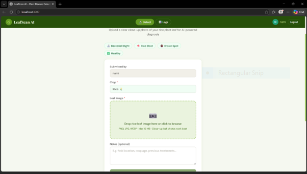
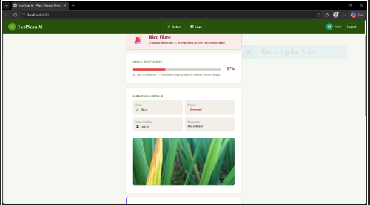
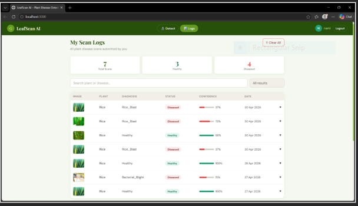

# 🌿 LeafScan – Rice Leaf Disease Detection using Enhanced YOLO

LeafScan is an AI-powered rice leaf disease detection system developed using an enhanced YOLO-based deep learning architecture. The project focuses on detecting rice diseases in real time using computer vision techniques and lightweight object detection models suitable for UAVs, embedded devices, and smart agriculture applications.

The proposed system is inspired by the research paper **“UAV T-YOLO-Rice: An Enhanced Tiny YOLO Networks for Rice Leaves Diseases Detection in Paddy Agronomy”**.

---

# 🚀 Features

✅ Rice leaf disease detection using YOLO  
✅ Real-time object detection  
✅ Lightweight architecture for embedded/UAV systems  
✅ Upload image and predict disease instantly  
✅ Bounding box localization with confidence score  
✅ Enhanced accuracy using attention modules  
✅ Web-based deployment using Netlify  

---

# 🎯 Diseases Detected

| Disease | Description |
|---|---|
| Bacterial Leaf Blight | Yellowish lesions on leaves |
| Rice Blast | Diamond-shaped infected regions |
| Brown Spot | Circular brown lesions on leaf surface |

---

# 🧠 Proposed Model Architecture

The project modifies Tiny-YOLOv4 by introducing several enhancements:

- Additional YOLO Detection Layer
- Spatial Pyramid Pooling (SPP)
- Convolutional Block Attention Module (CBAM)
- Sand Clock Feature Extraction Module (SCFEM)
- Ghost Module
- Additional Convolution Layers

These modifications improve:
- Small disease spot detection
- Feature extraction capability
- Real-time performance
- Detection robustness

---

# 📊 Dataset Information

The dataset was created using rice disease images collected from GitHub and expanded using image augmentation techniques.

## Original Dataset

| Class | Original Samples |
|---|---|
| Bacterial Leaf Blight | 96 |
| Rice Blast | 80 |
| Brown Spot | 100 |

## Image Augmentation Techniques

The dataset was extended using:

- Rotation (90°, 180°, 270°)
- Horizontal Mirroring
- Brightness Enhancement
- Brightness Reduction
- Gaussian Noise
- Saturation Noise
- Uniform Noise
- Image Filtering

Final dataset size: **15,456 images**

---

# ⚙️ Technologies Used

| Technology | Purpose |
|---|---|
| Python | Model development |
| PyTorch | Deep learning framework |
| YOLO | Object detection |
| OpenCV | Image processing |
| Flask | Backend API |
| HTML/CSS/JavaScript | Frontend |
| Netlify | Frontend deployment |

---

# 📂 Project Structure

```bash
LeafScan/
│
├── dataset/
│   ├── train/
│   ├── valid/
│   └── test/
│
├── models/
│   └── best.pt
│
├── static/
│   ├── uploads/
│   └── results/
│
├── templates/
│   └── index.html
│
├── app.py
├── detect.py
├── train.py
├── requirements.txt
└── README.md
```

---

# 🔬 Methodology

The system workflow consists of:

1. Collect rice disease images
2. Label disease regions
3. Apply image augmentation
4. Train enhanced YOLO model
5. Detect diseases using uploaded images
6. Display prediction with confidence score

The methodology also includes:
- Data preprocessing
- Dataset shuffling
- Train/validation/test split
- Bounding box prediction
- Confidence score calculation

---

# 📈 Performance Metrics

| Metric | Value |
|---|---|
| Testing mAP | 86.26% |
| FPS | 82 FPS |
| Training Time | 6.9 Hours |
| IoU | 61.39% |

---

# 🖥️ Web Application

🌐 Live Demo:  
https://leafscan-detect-disease.netlify.app

---
# 📸 Application Screenshots

## 🏠 Home Page

Features:
- Upload rice leaf image
- Detect Disease button
- Responsive UI

<p align="center">
  
</p>

---

## 🔍 Disease Detection Result

Example Output:

```text
Disease Detected: Rice Blast
Confidence Score: 94%
```

Bounding boxes and disease labels are displayed on the detected image.

<p align="center">
  
</p>

---

## 📋 Scan Log

Displays previously scanned disease records and prediction history.

<p align="center">
  
</p>
---

# ⚙️ Installation

## 1️⃣ Clone Repository

```bash
git clone https://github.com/15madhesh/leafscan.git
cd leafscan
```

## 2️⃣ Install Requirements

```bash
pip install -r requirements.txt
```

## 3️⃣ Run Application

```bash
python app.py
```

---

# ▶️ Usage

1. Open the web application
2. Upload a rice leaf image
3. Click **Detect Disease**
4. View prediction result
5. Observe bounding box and confidence score

---

# 📚 Research Contributions

The project contributions include:

1. Enhanced Tiny-YOLO architecture for rice disease detection  
2. Construction of a large rice disease dataset  
3. Better performance compared to existing lightweight models  

---

# 🔮 Future Enhancements

- Mobile App Integration
- Live Camera Detection
- Drone/UAV Deployment
- Multi-Crop Disease Detection
- Cloud-Based Analytics
- IoT Smart Farming Integration

---

# 👨‍💻 Developed By

**Madhesh**  
AI & Deep Learning Developer

---

# 📚 References

- UAV T-YOLO-Rice Research Paper
- YOLO Object Detection
- PyTorch Documentation
- OpenCV Documentation
- RiceDiseases Dataset

Dataset Source:  
https://github.com/aldrin233/RiceDiseases-DataSet

---

# ⭐ Conclusion

LeafScan provides a lightweight and accurate deep learning solution for rice leaf disease detection using enhanced YOLO architecture. The project supports smart agriculture by enabling fast, reliable, and real-time disease diagnosis suitable for UAV and embedded applications.
